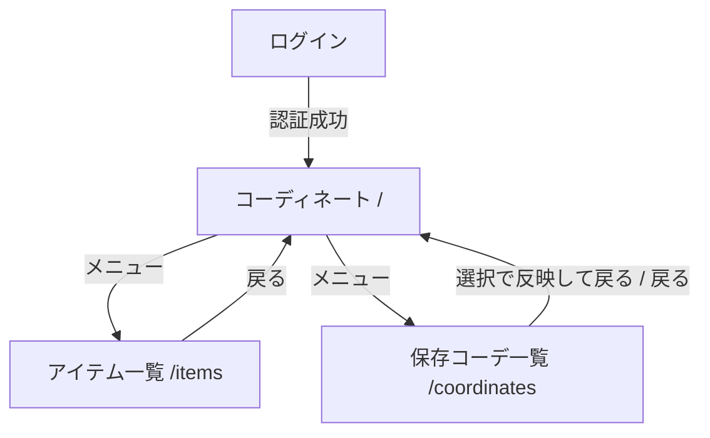
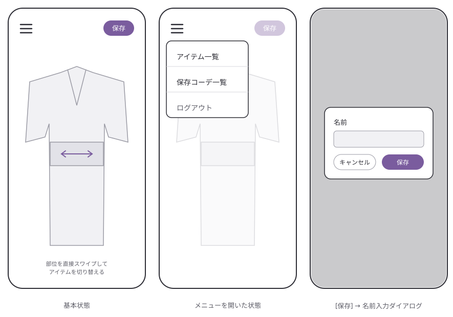
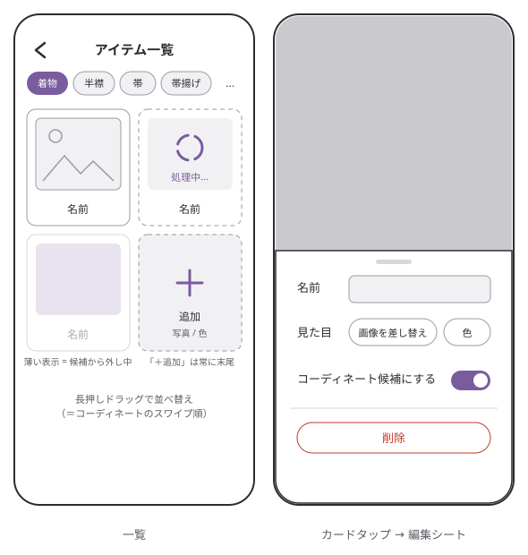
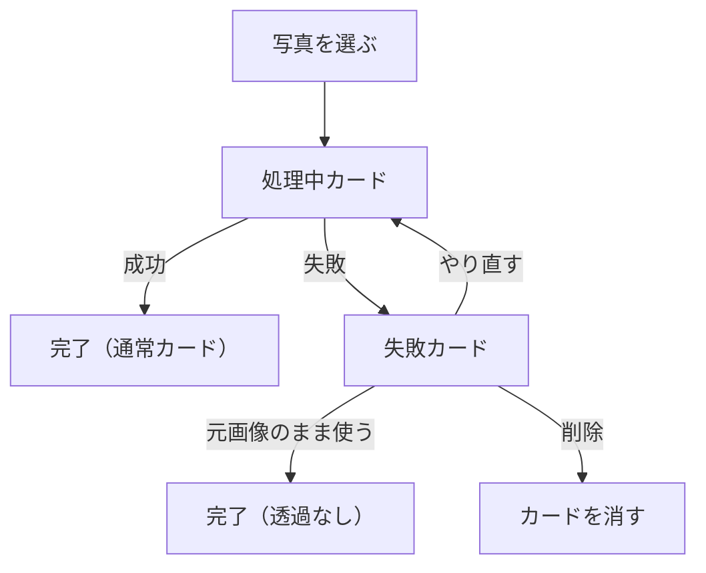
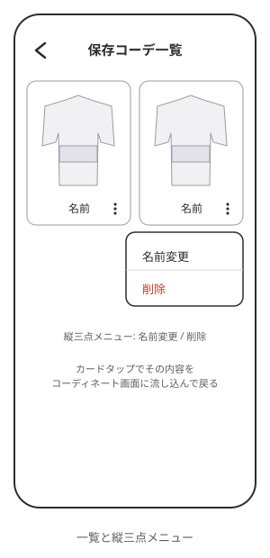
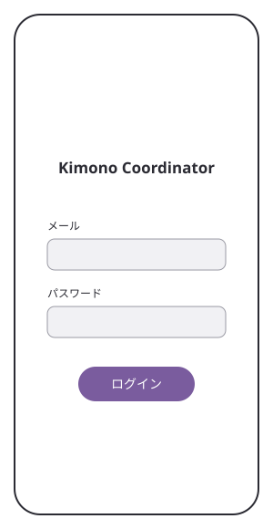

# 画面ワイヤーフレーム

段階 1（画面の骨格を決める）の成果物。各画面に何を置き、どう行き来するかをまとめる。
要素の有無と配置、遷移が分かる程度にとどめ、見た目の詳細は段階 2 に委ねる。
前提は `app-outline.md`、進め方は `app-design-plan.md` を参照。

## 画面の一覧

ルートとして持つ画面は次の 4 つ。

| 画面           | パス           | 表示条件   |
| -------------- | -------------- | ---------- |
| コーディネート | `/`            | 認証済み   |
| アイテム一覧   | `/items`       | 認証済み   |
| 保存コーデ一覧 | `/coordinates` | 認証済み   |
| ログイン       | （未認証時）   | 未認証のみ |

`app-outline.md` の 4 画面のうち**アイテム登録は独立した画面にしない**。
アイテムの詳細・編集も画面にせず、どちらもアイテム一覧の中のシートで行う。

## 判断の理由

### アイテム登録を画面にしない

- モードレス方針（`app-design-plan.md`）に「アイテムの追加を独立した手順の流れにせず、
  一覧にいるまま足せるようにする」とあり、登録専用画面はこれと矛盾する
- 背景透過の 20〜30 秒とも両立できる。写真を選んだ瞬間に一覧へ「処理中カード」として
  即座に追加し、透過処理は裏で走らせる。処理中も一覧の閲覧・別アイテムの追加・
  コーディネートへの移動を続けられるため、待たされるモードが発生しない
- 透過に失敗してもカード上で復帰できる（後述の状態遷移を参照）

### アイテムの詳細・編集も画面にしない

アイテムの属性は名前・カテゴリ・見た目しかなく、カードをタップして開くシートで
名前と色の変更、画像の差し替え、削除まで収まる。別画面にするほどの情報量がない。

### ログイン画面を足す

データを Supabase に置くため、未認証時の入口が要る。認証は最小限との方針なので
未認証時だけ表示される 1 画面とし、ログアウトはコーディネート画面のメニューに置く。

### 保存はスナップショット

保存は「いま表示している組み合わせを 1 件記録する」だけの操作。保存後も
コーディネート画面は保存物に紐づかず、そのまま組み合わせを試し続けられる。
保存済みコーディネートの上書き更新は骨格には含めない（名前変更と削除のみ）。
中身を差し替えたい場合は、新しく保存して古い方を消す。

### インジケーター列と選択情報は置かない

現状の `KimonoView` にはシルエットの下に選択情報のテキストと 7 カテゴリ分の
ドットインジケーター列があるが、コーディネート画面には持ち込まない。

- 切り替えはシルエット直接スワイプで完結しており、操作として重複している
- アイテムが増えるとドットの数が破綻する（実データの数十個では機能しない）
- スマホ 1 画面にシルエットと保存ボタンを収めるのが最優先で、置く余地がない

切り替わったアイテム名の一時表示なども、まずは置かずに始める。
フィードバックが足りないと分かったら段階 2 以降で検討する。

### コーディネート候補フラグはアイテムごとに 1 つ

季節外のアイテムなどを登録したまま休ませられるよう、「コーディネート候補から外す」
フラグをアイテムに持たせる。候補の組（スワイプ対象群）に名前をつけて保存し
切り替える案も考えたが、まずはシンプルにアイテムごとのフラグ 1 つにとどめる。

## 遷移図

- コーディネートが起点。アイテム一覧と保存コーデ一覧へはメニューから行く
- 保存コーデ一覧で 1 件選ぶと、その内容をコーディネート画面に流し込んで戻る
- アイテム一覧と保存コーデ一覧の間の直接遷移は置かない（必ずコーディネートを経由）

## 各画面

### コーディネート（`/`）

既存のメイン画面に、保存とメニューの導線を足す。シルエットが画面の大部分を占め、
それ以外の常設要素はメニューと保存ボタンだけにする。

- 切り替え操作はシルエット上の直接スワイプのみ。インジケーター列や選択情報の
  テキストは置かない（理由は前述）
- スワイプ候補は、アイテム一覧での並び順に、候補フラグの立っているものだけを回す
- 保存はダイアログ 1 つで完結し、保存後も画面はそのまま（モードを作らない）
- 空状態: アイテムが無いカテゴリは「未選択」のシルエットで表示する。
  全カテゴリが空の初回は、シルエットの下にアイテム一覧への誘導を出す

### アイテム一覧（`/items`）

- カテゴリはタブで切り替える（7 種固定）
- 「＋追加」はカード群の末尾に常設。「写真を撮る / 選ぶ」か「色を選ぶ」を選んだら
  即カードが増え、画面遷移しない
- カードの長押しドラッグで並べ替えられる。**この並び順がコーディネート画面の
  スワイプ順になる**。並べ替えモードは作らず、その場で入れ替える
- 「コーディネート候補から外す」はカードを薄く表示して区別する。一覧には居続けるが、
  コーディネート画面のスワイプ候補には出ない。保存済みコーディネートが参照している
  場合、開いたときの表示はされる（スナップショットは壊さない）
- 空のカテゴリは「＋追加」だけが見える状態になる
- 編集シートは開いたその場で書き換える。保存ボタンは置かず、閉じたら反映済み

### 処理中カードの状態遷移

- 処理中・失敗のあいだも他の操作は一切ブロックしない
- 処理中のアイテムはコーディネート画面のスワイプ候補には出さない
  （完了して初めて選べるようになる）

### 保存コーデ一覧（`/coordinates`）

- カードは小さなシルエットプレビューと名前
- タップでその内容をコーディネート画面に流し込んで戻る
- 名前変更と削除はカードの縦三点メニューから。上書き更新は無い
- 空状態: 「コーディネート画面で保存するとここに並ぶ」旨の案内だけを出す

### ログイン（未認証時）

- 認証フォームのみ。単一ユーザー前提なのでサインアップ導線は最小限でよい
  （方式の詳細は Supabase 接続時に決める）
- 認証済みなら表示せず、直接コーディネート画面を開く
